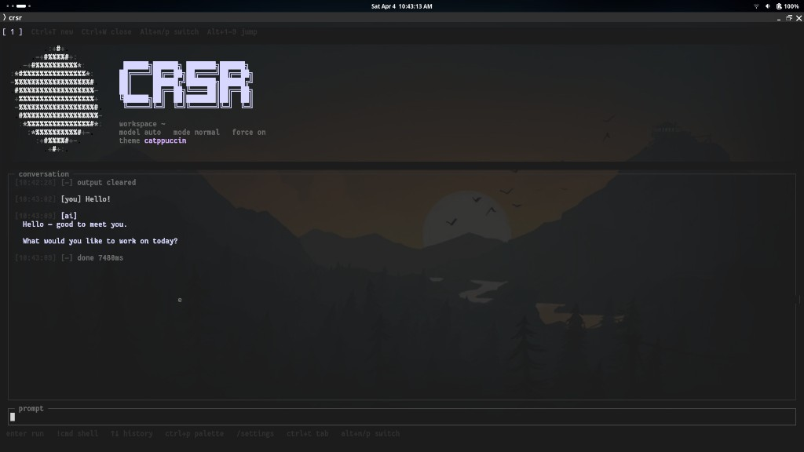
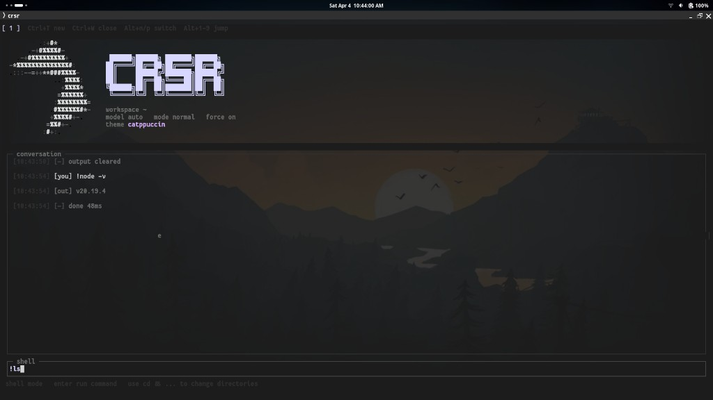
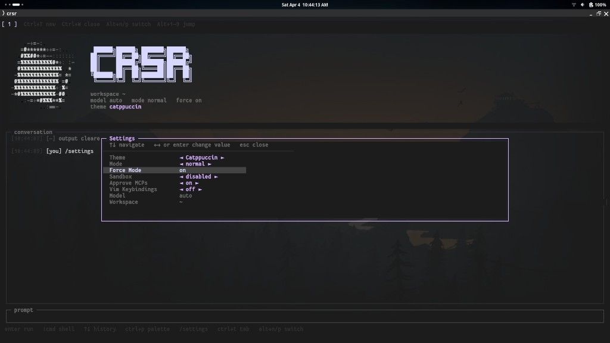

# crsr

`crsr` is a full-screen terminal shell for `cursor-agent`.

It gives Cursor Agent a dedicated TUI with persistent session state, slash commands, local shell mode, workspace switching, and a cleaner “stay in the terminal” workflow for both interactive use and one-shot automation.

**Latest release:** [v1.0.3](https://github.com/neutro74/crsr/releases/tag/v1.0.3) (`crsr --version` should print `1.0.3` when built from this tag).

## What crsr Does

- Runs `cursor-agent` inside a dedicated full-screen terminal UI.
- Keeps a persistent workspace, model, mode, and command history between launches.
- Supports normal prompts, plan mode, ask mode, and headless one-shot execution.
- Adds local shell mode with `!command` so you can run terminal commands inline.
- Exposes common `cursor-agent` features as slash commands instead of raw flags.
- Supports MCP management, chat resume/continue flows, cloud mode, and worktrees.
- **Tabs:** multiple conversations at once (`Ctrl+T` / `Ctrl+W`, `Alt+1-9` to jump, `Alt+n` / `Alt+p` to cycle).
- **Themes:** built-in palettes (e.g. dark, Dracula, Nord, Gruvbox, Catppuccin); change with `/theme` or the Settings panel.
- **Command palette:** fuzzy search all commands (`Ctrl+P`).
- **Settings panel:** edit session options without memorizing slash commands (`/settings`).
- **Vim-style bindings:** optional (`/vim`): transcript scroll, ESC normal mode, `i` / Enter back to insert.
- **Neovim:** `/nvim [file]` suspends the TUI and opens Neovim in the workspace.
- **Thinking + subagents:** shows darker thinking text and subagent activity in the transcript.
- Install as a local Node wrapper from this repo, or use **standalone binaries** from GitHub Releases (Linux, macOS, Windows x64).

## Screenshots


### Launch screen


### Agent response



### Shell mode



### Settings panel



## Core Features

### Full-screen TUI

- Animated branded header and status bar.
- Conversation transcript with timestamps and tone labels.
- Input history navigation and slash-command autocomplete.
- Markdown-aware rendering for agent responses.

### Tabs

- `Ctrl+T` new tab, `Ctrl+W` close tab (not the last tab).
- `Alt+1` … `Alt+9` jump to tab by index; `Alt+n` / `Alt+p` next/previous tab.
- `/tab [new|close|<n>]` for the same actions from the prompt.

### Themes and settings

- `/theme <name>` or open **Settings** with `/settings` to change theme, mode, force, sandbox, MCP approval, vim bindings, and more.
- Arrow keys navigate settings; left/right or Enter adjusts values; Esc closes.

### Command palette

- `Ctrl+P` opens a searchable list of all slash commands; Enter inserts the chosen usage into the prompt.

### Prompting modes

- Plain text sends a normal agent prompt.
- `/plan` or `/mode plan` switches to planning mode.
- `/ask` or `/mode ask` switches to read-only Q&A mode.
- `/new-chat` clears active resume/continue state and starts fresh.

### Local shell mode

- Prefix input with `!` to run a shell command in the active workspace.
- Uses your login shell via `$SHELL`.
- Streams command output directly into the transcript.
- Best for short, non-interactive commands.
- Commands time out after 30 seconds.

Examples:

```bash
!pwd
!git status
!cd src && npm test
```

### Session memory

crsr persists session state across launches:

- command history
- recent workspaces
- active workspace
- selected model
- selected mode
- force / auto-run state
- sandbox setting
- MCP auto-approval setting
- custom headers

It also supports in-session transient state for:

- API keys
- `--continue`
- pinned `--resume <chatId>`

### Workspace control

- `/workspace [path]` and `/cd [path]`
- `/recent [n]`
- per-workspace prompting context

### Agent control

- `/model [name|reset]`
- `/force`
- `/auto-run [on|off|status]`
- `/sandbox [enabled|disabled|off]`
- `/approve-mcps`
- `/continue`
- `/resume [chatId|clear]`
- `/api-key [key|clear]`
- `/header [add <Name: Value>|remove <n>|list|clear]`

### Cursor Agent passthrough

crsr exposes common `cursor-agent` commands directly:

- `/login`
- `/logout`
- `/status`
- `/whoami`
- `/about`
- `/models`
- `/update`
- `/generate-rule`
- `/rule`
- `/rules`
- `/install-shell-integration`
- `/uninstall-shell-integration`
- `/setup-terminal`
- `/acp`
- `/raw <args...>`

### Sessions, chats, MCPs, and worktrees

- `/ls`
- `/create-chat`
- `/cloud`
- `/worktree [name] [--base <branch>] [--skip-setup]`
- `/mcp list`
- `/mcp login <id>`
- `/mcp list-tools <id>`
- `/mcp enable <id>`
- `/mcp disable <id>`

## CLI Usage

```bash
crsr [options] [initial command or prompt...]
```

Options:

- `--workspace <path>`: start in a specific workspace
- `--once`: run one prompt or command headlessly, then exit
- `--update`: download the latest GitHub release binary and replace the current `crsr` executable (see limitations below)
- `-h`, `--help`: show help
- `-v`, `--version`: show version

Examples:

```bash
crsr
crsr --workspace ~/project
crsr --once "summarize this repository"
crsr --once /status
crsr --once '!pwd'
crsr --update
```

## Configuration

Global config lives at `~/.config/crsr/config.json` and supports:

```json
{
  "binaryPath": "/custom/path/to/cursor-agent",
  "workspace": "/default/workspace/path",
  "defaultModel": "gpt-5",
  "defaultMode": "normal",
  "forceMode": false,
  "trustPrintMode": true,
  "commandPassthrough": true,
  "approveMcps": false,
  "sandbox": "enabled",
  "apiKey": "optional-session-default",
  "defaultHeaders": ["X-Foo: bar"]
}
```

`cursor-agent` binary resolution order:

1. `binaryPath` in config
2. `CURSOR_AGENT_BINARY`
3. `~/.local/bin/cursor-agent`
4. `cursor-agent` on `PATH`

## Install and run (from source)

Requirements:

- Node.js 18+
- a working `cursor-agent` installation

```bash
git clone https://github.com/neutro74/crsr.git
cd crsr
npm install
```

Run in development (TypeScript via `tsx`):

```bash
npm run dev
```

Install a local launcher script into `~/.local/bin/crsr` that runs the bundled app from this checkout:

```bash
npm run release
```

That runs `npm run bundle` and `scripts/install-local-wrapper.mjs`, producing `dist/crsr.cjs` and wiring the wrapper to it.

Type-check only:

```bash
npm run check
```

Compile TypeScript to `dist/` (without bundling the single file):

```bash
npm run build
```

## Standalone binaries (GitHub Releases)

Prebuilt executables are attached to each release. For **v1.0.3** the assets are:

| Platform | Asset name |
|----------|------------|
| Linux x64 | `crsr-linux-x64` |
| macOS x64 | `crsr-macos-x64` |
| macOS arm64 | `crsr-macos-arm64` |
| Windows x64 | `crsr-win-x64.exe` |

Download from the [Releases](https://github.com/neutro74/crsr/releases) page, mark the binary executable on Unix (`chmod +x`), and ensure `cursor-agent` is available per the resolution order above.

These are CLI binaries (not macOS `.app` bundles); run them from a terminal.

## Build standalone binaries locally

From a clean checkout with dependencies installed:

**Linux x64 only** (matches `package:linux`):

```bash
npm run package:linux
```

Output: `release/crsr-linux-x64`

**All release binaries in one step** (same targets as the release pipeline):

```bash
npm run package:all
```

Outputs:

- `release/crsr-linux-x64`
- `release/crsr-macos-x64`
- `release/crsr-macos-arm64`
- `release/crsr-win-x64.exe`

`pkg` may emit bytecode warnings for some dependencies; the executables should still run.

## Self-update (`--update` and `/crsr-update`)

```bash
crsr --update
```

From the TUI you can run:

```text
/crsr-update
```

(`/update` still delegates to `cursor-agent` and updates the agent, not crsr.)

The updater downloads the **latest** GitHub release and replaces the active `crsr` executable when it can resolve the install path:

- **Packaged binary:** `process.execPath` (standalone `pkg` builds).
- **`CRSR_INSTALL_PATH`:** explicit path to the standalone binary to replace.

Source installs created by `npm run release` use a shell wrapper in `~/.local/bin/crsr`. The updater now refuses to overwrite that wrapper; rebuild from source instead, or point `CRSR_INSTALL_PATH` at a standalone release binary.

**Platform → release asset:**

| OS | Node `process` | Asset |
|----|----------------|--------|
| Linux x64 | `linux` + `x64` | `crsr-linux-x64` |
| macOS Intel | `darwin` + `x64` | `crsr-macos-x64` |
| macOS Apple Silicon | `darwin` + `arm64` | `crsr-macos-arm64` (falls back to `crsr-macos-x64` if needed) |
| Windows x64 | `win32` + `x64` | `crsr-win-x64.exe` |

Other platforms (for example Linux arm64) have no matching release asset yet; self-update will report an error.

On Windows, replacing a file that is still running can fail; quit `crsr` and run `crsr --update` from another terminal if you hit a file-lock error.

## Release versioning

- Release tags (for example `v1.0.3`) correspond to [GitHub Releases](https://github.com/neutro74/crsr/releases).
- `npm run prepare:version` syncs `src/version.ts` from `package.json`, so `crsr -v`, the bundled wrapper, and `pkg` output stay aligned. Release builds should run `npm run bundle` (or a script that runs `prepare:version` first) before packaging.
