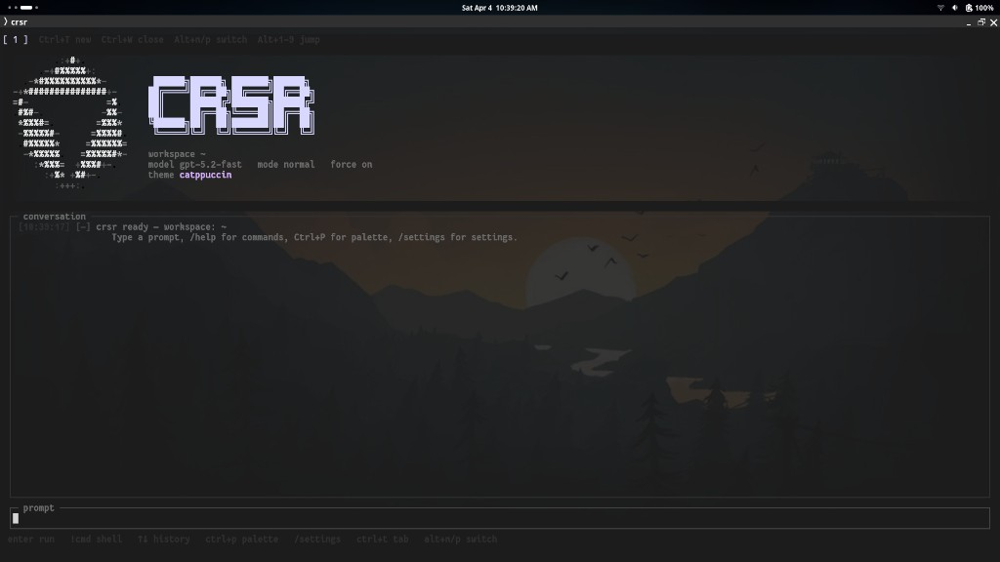
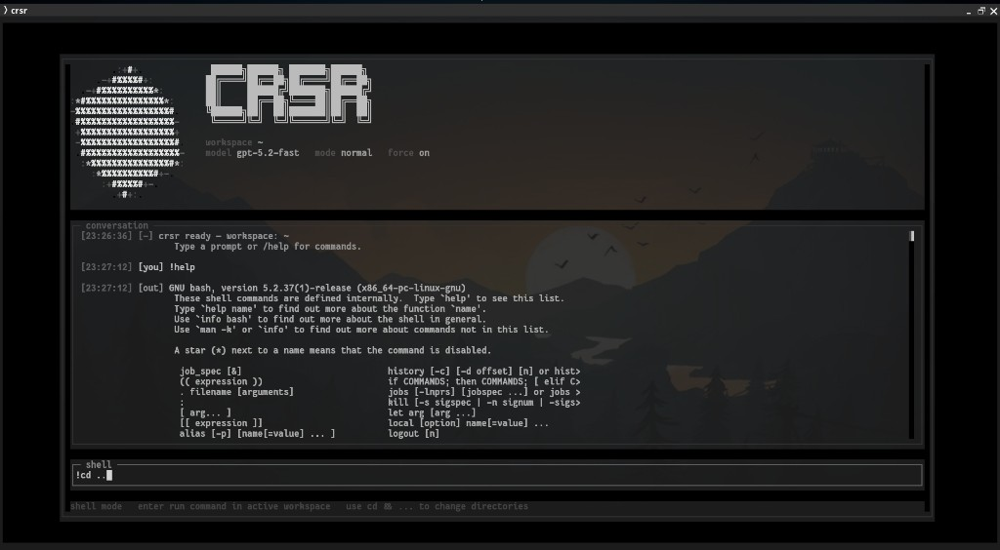

# crsr

`crsr` is a full-screen terminal shell for `cursor-agent`.

It gives Cursor Agent a dedicated TUI with persistent session state, slash commands, local shell mode, workspace switching, and a cleaner "stay in the terminal" workflow for both interactive use and one-shot automation.

## What crsr Does

- Runs `cursor-agent` inside a dedicated full-screen terminal UI.
- Keeps a persistent workspace, model, mode, and command history between launches.
- Supports normal prompts, plan mode, ask mode, and headless one-shot execution.
- Adds local shell mode with `!command` so you can run terminal commands inline.
- Exposes common `cursor-agent` features as slash commands instead of raw flags.
- Supports MCP management, chat resume/continue flows, cloud mode, and worktrees.
- Can be installed as a normal local wrapper or packaged as a standalone Linux binary.

## Screenshots

### Launch screen



### Shell mode



### Agent response


## Core Features

### Full-screen TUI

- Animated branded header and status bar.
- Conversation transcript with timestamps and tone labels.
- Input history navigation and slash-command autocomplete.
- Markdown-aware rendering for agent responses.

### Prompting modes

- Plain text sends a normal agent prompt.
- `/plan` or `/mode plan` switches to planning mode.
- `/ask` or `/mode ask` switches to read-only Q&A mode.
- `/new-chat` clears active resume/continue state and starts fresh.

### Local shell mode

- Prefix input with `!` to run a shell command in the active workspace.
- Uses your login shell via `$SHELL`.
- Streams command output directly into the transcript.
- Best for short, non-interactive commands.
- Commands time out after 30 seconds.

Examples:

```bash
!pwd
!git status
!cd src && npm test
```

### Session memory

crsr persists session state across launches:

- command history
- recent workspaces
- active workspace
- selected model
- selected mode
- force / auto-run state
- sandbox setting
- MCP auto-approval setting
- custom headers

It also supports in-session transient state for:

- API keys
- `--continue`
- pinned `--resume <chatId>`

### Workspace control

- `/workspace [path]` and `/cd [path]`
- `/recent [n]`
- per-workspace prompting context

### Agent control

- `/model [name|reset]`
- `/force`
- `/auto-run [on|off|status]`
- `/sandbox [enabled|disabled|off]`
- `/approve-mcps`
- `/continue`
- `/resume [chatId|clear]`
- `/api-key [key|clear]`
- `/header [add <Name: Value>|remove <n>|list|clear]`

### Cursor Agent passthrough

crsr exposes common `cursor-agent` commands directly:

- `/login`
- `/logout`
- `/status`
- `/whoami`
- `/about`
- `/models`
- `/update`
- `/generate-rule`
- `/rule`
- `/rules`
- `/install-shell-integration`
- `/uninstall-shell-integration`
- `/setup-terminal`
- `/acp`
- `/raw <args...>`

### Sessions, chats, MCPs, and worktrees

- `/ls`
- `/create-chat`
- `/cloud`
- `/worktree [name] [--base <branch>] [--skip-setup]`
- `/mcp list`
- `/mcp login <id>`
- `/mcp list-tools <id>`
- `/mcp enable <id>`
- `/mcp disable <id>`

## CLI Usage

```bash
crsr [options] [initial command or prompt...]
```

Options:

- `--workspace <path>`: start in a specific workspace
- `--once`: run one prompt or command headlessly, then exit
- `--update`: download the latest GitHub release binary and replace the current `crsr` executable
- `-h`, `--help`: show help
- `-v`, `--version`: show version

Examples:

```bash
crsr
crsr --workspace ~/project
crsr --once "summarize this repository"
crsr --once /status
crsr --once '!pwd'
crsr --update
```

## Configuration

Global config lives at `~/.config/crsr/config.json` and supports:

```json
{
  "binaryPath": "/custom/path/to/cursor-agent",
  "workspace": "/default/workspace/path",
  "defaultModel": "gpt-5",
  "defaultMode": "normal",
  "forceMode": false,
  "trustPrintMode": true,
  "commandPassthrough": true,
  "approveMcps": false,
  "sandbox": "enabled",
  "apiKey": "optional-session-default",
  "defaultHeaders": ["X-Foo: bar"]
}
```

`cursor-agent` binary resolution order:

1. `binaryPath` in config
2. `CURSOR_AGENT_BINARY`
3. `~/.local/bin/cursor-agent`
4. `cursor-agent` on `PATH`

## Install and Run

Requirements:

- Node.js 18+
- a working `cursor-agent` installation

Install dependencies and install the local wrapper:

```bash
npm install
npm run release
```

That bundles the app and installs a local `crsr` launcher in `~/.local/bin/crsr`
which points at this checkout's `dist/crsr.cjs`.

You can also run from source:

```bash
npm run dev
```

## Standalone Binary

crsr can also be packaged as a self-contained Linux binary:

```bash
npm run package:linux
```

This produces:

```text
release/crsr-linux-x64
```

That artifact is the standalone binary you can attach to a GitHub release.

Installed standalone binaries and locally installed wrappers can self-update with:

```bash
crsr --update
```

The updater currently targets the Linux x64 release asset published on GitHub and
replaces the active `crsr` executable in place.

## Release Notes

- The current release version is `0.2.1`.
- `npm run prepare:version` syncs `src/version.ts` from `package.json` so the CLI
  version output, bundled wrapper, and packaged binary stay aligned.
